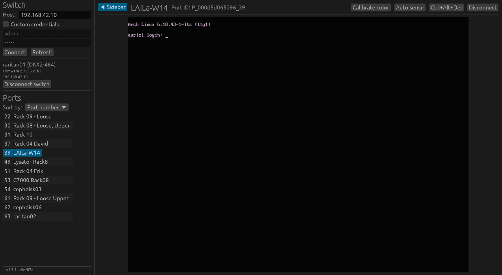

# `raritan-mpc-rs`

A feature-incomplete **vibecoded** rewrite of "Raritan Multi-Platform Client".

## How much of this is LLM-generated?

The commits with message starting with `(slop)` contain LLM output.

**This README and the logo are the only two things in this project that are 100% created by a human.**

The Rust code and the documentation is probably 99% LLM output.

If you hate LLMs and/or don't trust the code, that's very understandable.

## Why did you do this?

The official Raritan MPC written in Java requires Java 8, and hacking around so that Java accepts using TLSv1. Take a look at this community-made Nix flake to get a feel: <https://gitlab.com/B4dM4n/raritan-mpc>.

I just want a static binary that works.

I also was morbidly curious how little of the source code a vibecoder needs to understand (_spoiler- nothing_).

## How did you do this?

I get some free LLM usage from my university (copilot), so I gave the LLM a lot of data to work with

- Network traffic:
    1. I used Wireshark to sniff data sent to/from the KVM switch.
    2. I used [jSSLKeyLog](https://github.com/jsslkeylog/jsslkeylog) to make SSL connections able to be read unecrypted.
    3. I used the Java client, in different ways, performing a new capture per distinct action, and clearly annotating what I did for the LLM to later try to understand.

- Java source code, decompiled from the `.jar`.
  - I was very surprised you could extract source code, even preserving comments, from `.jar` files.
  - I used [`cfr`](https://www.benf.org/other/cfr/) for this.

- Very high-level prompts like:
  - "Rewrite Raritan MPC in Rust. Take inspiration from the decompiled Java source code, and validate byte-for-byte that the network requests you make match what I've captured."
  - "Split the code into multiple crates where it makes sense."
  - "Use `egui` for the GUI"
  - "Make the code as simple as possible. Try to use existing crates where it makes sense, but don't try to shoehorn a framework where it only adds complexity. It's fine to reinvent the wheel if it suits the code better."
  - "DO NOT USE ASYNC!"
  - "Create a documentation site using Zensical, both for you LLMs and for humans."
